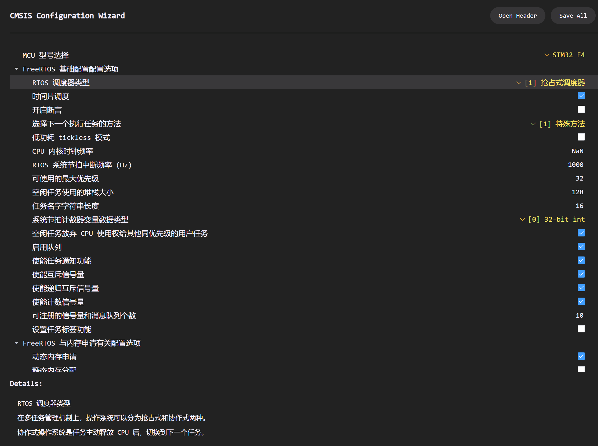

<div align="center">
	<h1>FreeRTOS-Lite</h1>
</div>


FreeRTOS 精简移植代码 - 适配 STM32 STD 与 HAL 库

`FreeRTOSConfig.h` 支持 *Configuration Wizard*



> [!warning]
>
> 若运行报错 `Error: L6218E: Undefined symbol CPU_RunTime (referred from tasks.o).`
>
> 请查看 `FreeRTOSConfig.h` 文件第 307-310 行代码，此处代码为**运行时间统计功能**所需代码，若不使用该功能则将 307-310 行代码注释即可，若使用该功能则查看下面 Note 内容

> [!note]
>
> 当使用**运行时间统计功能**时需注意：
>
> > 若工程中添加使用了 [libstm](https://github.com/SprInec/libstm) 库，在 `bsp_config.h` 的 System configuration -> RTOS 中选择 `FreeRTOS` 即可，无须理会下面的步骤。
>
> 第 307~310 行的代码(如下)
>
> ```c
> #if (configGENERATE_RUN_TIME_STATS)
> extern volatile uint32_t CPU_RunTime;
> 
> #define portCONFIGURE_TIMER_FOR_RUN_TIME_STATS() (CPU_RunTime = 0ul)
> #define portGET_RUN_TIME_COUNTER_VALUE() CPU_RunTime
> #endif /* configGENERATE_RUN_TIME_STATS */
> ```
>
> 涉及的变量 `CPU_RunTime` 需根据所用芯片自行提供，以下提供 `timbase.h` 与 `timbase.c` 的参考实现：
>
> ```c
> // timbase.h
> #ifndef __BSP_TIMBASE_H
> #define __BSP_TIMBASE_H
> #ifdef __cplusplus
> extern "C" {
> #endif /* __cplusplus */
> #include "stm32f4xx_hal.h"
> 
> #define TIMBASE_TIM USE_TIM6
> 
> #if (TIMBASE_TIM == USE_TIM6)
> #define FREERTOS_TIMBASE                  TIM6
> #define FREERTOS_TIMBASE_Period           1000 - 1
> #define FREERTOS_TIMBASE_Prescaler        71
> #define FREERTOS_TIMBASE_IRQn             TIM6_DAC_IRQn
> #define FREERTOS_TIMBASE_IRQHandler       TIM6_DAC_IRQHandler
> 
> #elif (TIMBASE_TIM == USE_TIM7)
> #define FREERTOS_TIMBASE                  TIM7
> #define FREERTOS_TIMBASE_Period           1000 - 1
> #define FREERTOS_TIMBASE_Prescaler        71
> #define FREERTOS_TIMBASE_IRQn             TIM7_IRQn
> #define FREERTOS_TIMBASE_IRQHandler       TIM7_IRQHandler
> #endif
> 
> void BSP_FREERTOS_TIMBASE_Init(void);
> 
> #ifdef __cplusplus
> }
> #endif /* __cplusplus */
> #endif /* !__BSP_TIMBASE_H */
> ```
>
> ```c
> // timbase.c
> volatile uint32_t CPU_RunTime = 0UL;
> TIM_HandleTypeDef FREERTOS_TIMBASE_Handle;
> 
> static void FREERTOS_TIMBASE_Config(void)
> {
>     FREERTOS_TIMBASE_Handle.Instance = FREERTOS_TIMBASE;
>     FREERTOS_TIMBASE_Handle.Init.Period = FREERTOS_TIMBASE_Period;
>     FREERTOS_TIMBASE_Handle.Init.Prescaler = FREERTOS_TIMBASE_Prescaler;
>     FREERTOS_TIMBASE_Handle.Init.CounterMode = TIM_COUNTERMODE_UP;
>     FREERTOS_TIMBASE_Handle.Init.AutoReloadPreload = TIM_AUTORELOAD_PRELOAD_ENABLE;
>     if (HAL_TIM_Base_Init(&FREERTOS_TIMBASE_Handle) != HAL_OK)
>     {
>         Error_Handler();
>     }
> 
> #if (TIMBASE_TIM == USE_TIM6)
>     __HAL_RCC_TIM6_CLK_ENABLE();
> #elif (TIMBASE_TIM == USE_TIM7)
>     __HAL_RCC_TIM7_CLK_ENABLE();
> #endif
>     HAL_NVIC_SetPriority(FREERTOS_TIMBASE_IRQn, 1, 0);
>     HAL_NVIC_EnableIRQ(FREERTOS_TIMBASE_IRQn);
> }
> 
> void BSP_FREERTOS_TIMBASE_Init(void)
> {
>     FREERTOS_TIMBASE_Config();
>     HAL_TIM_Base_Start_IT(&FREERTOS_TIMBASE_Handle);
> }
> 
> void FREERTOS_TIMBASE_IRQHandler(void)
> {
>     HAL_TIM_IRQHandler(&FREERTOS_TIMBASE_Handle);
>     CPU_RunTime++;
> }
> ```
